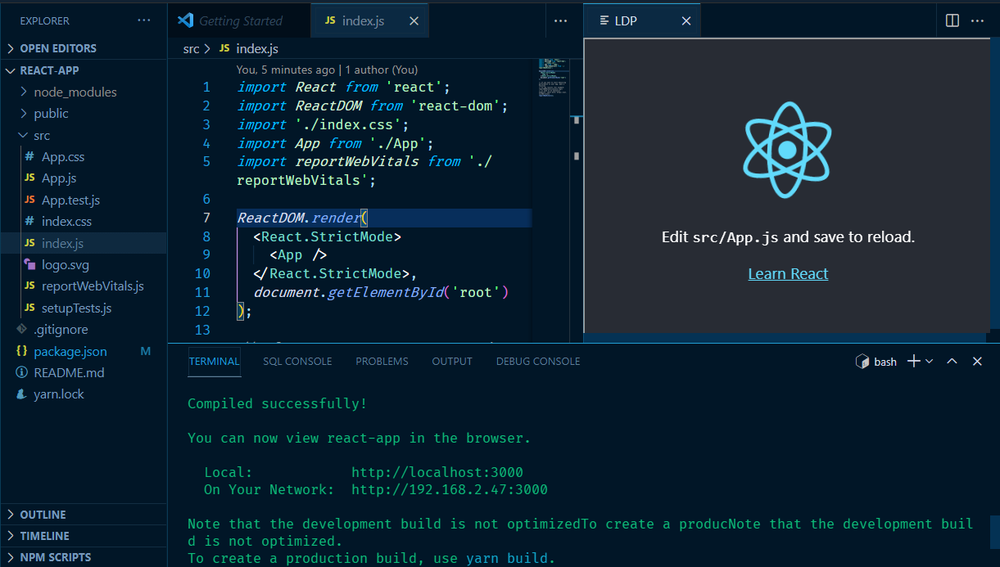

# Loco Developer Preview (LDP)

Incredibly lightweight VSCode extension to **preview** your **local** **dev** servers in editor.
LDP is an attempted replica of extension (built?) and used by [@SimonSwiss](https://twitter.com/simonswiss) as seen in his youtube tutorial videos. Note: _Simon's extension also has responsive mode controls, not present here..._

This is a great solution for people like me who have a "gazillion" tabs and windows open, and hate alt-tabbing back and forth.

Simplicity was the main focus of this extension. The VSCode webview (electron's iframe equivalent) is simply pointing to your localhost server. There are other extension variants that are far more intricate and feature-rich than this (namely [vscode-browser-preview](https://github.com/auchenberg/vscode-browser-preview) by [Kenneth Auchenberg](https://twitter.com/auchenberg)).
## HTTP vs HTTPS vs localhost vs non-localhost

This extension is not a replacement for your system's web browser and all the securities that come with it! That is why the **default setting** enforces `http://localhost` urls however this guard can be disabled in the vscode settings **at your own risk**.

`File -> Preferences -> Settings -> LDP: restrictToHttp` boolean flag to enable strict localhost url domain.
## Basic Usage

### Launch

- `ctrl + shift + p` to open command palette
- select `"Loco Developer Preview: Launch"`

### Changing source URL

- `ctrl + shift + p` to open command palette
- select `"Loco Developer Preview: Change URL Source"`

## Autodetecting Failed Requests

From my research, it looks like electron's webviews do not allow peering into the contentDocument unlike web browser's iframes. It also does not suffice to look at the onload of the webview iframes; even with network failures or CORS policy block, iframe onload will still be called.

XMLHttpRequest does not have a "no-cors" mode request header flag option. To "ping" the server, the fetch API is used to see if network connection can be established with the "no-cors" mode header option.

Still there may be network scenarios that I have not covered, so any contributions are welcomed!

## Credit

Thank you [Teresa Gawargy](https://www.linkedin.com/in/teresa-gawargy-7b541a168/) for the awesome logo!

## Known Issues

- No Responsive Mode Controls similar to modern browser's Developer Tools

## Release Notes

### 0.0.1

Initial release of LDP

---

**Enjoy!**
